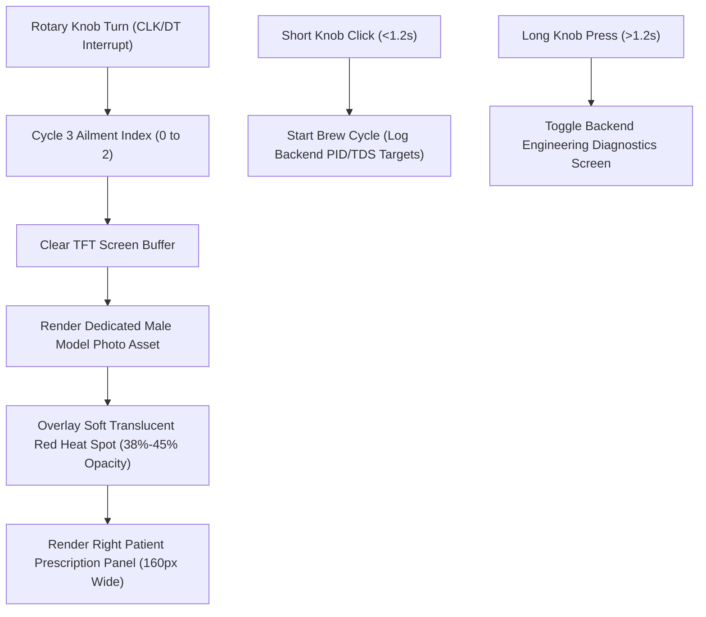

# iKwath Display Subsystem & UI Architecture

> **System Component:** ESP32 Display Controller & User Interface  
> **Hardware:** 2.8" ILI9341 SPI TFT Display (320x240 Resolution) + Rotary Encoder

---

## 1. Subsystem Overview & Visual Concept

The display controller manages patient interactions for selecting 3 core prescribed kwatha formulations based on visual symptom presentation.

### Key Visual & UX Design Rules:
1. **3 Prescribed Options:** Streamlined UI menu presenting 3 core kwatha options (Joint Pain, Cold & Chest Congestion, Headache & Migraine).
2. **Dedicated Human Model Photography:** Displays high-definition athletic male model photos with pained suffering expressions.
3. **Soft Translucent Infrared Heat Spot Overlay (Lower Opacity: 38%-45%):** Adjusted pain spot opacity from dark solid red down to a soft, semi-transparent coral red heat aura with radial blur.
4. **Clean Patient UI Mode:** Only patient-essential info is displayed on the main LCD:
   - **Ailment / Symptom Title**
   - **Prescribed Powder Name**
   - **Required Powder Weight** (`21.0 g`)
   - **Body Model Pain Spot Graphic**
5. **Backend System Diagnostics:** All engineering parameters (Water Dosing Target `84 ml`, Heater Temp `85–90 °C`, Target Delta TDS, Extraction Curve Time) are hidden from the patient UI and logged/managed in the backend system (accessible via Long Press >1.2s on Rotary Knob or Serial/Firebase log stream).

---

## 2. Formulation & Backend Parameter Matrix (3 Options)

| Index | Ailment / Symptom | Model Photo Asset | Pain Spot Opacity | Patient Displayed Info | Backend Water Target | Backend Heater Band | Backend Target Delta TDS |
|---|---|---|---|---|---|---|---|
| **0** | **Joint & Knee Pain** | Knee Joint Model Photo | Soft Translucent (40%) | Dashamula Yavakuta (21.0 g) | 84 ml (±1.5g) | 85.0 °C – 90.0 °C | 312 ppm (12 min) |
| **1** | **Cold & Chest Congestion** | Chest Lungs Model Photo | Soft Translucent (40%) | Trikatu & Sitopaladi (21.0 g) | 84 ml (±1.5g) | 88.0 °C – 90.0 °C | 285 ppm (10 min) |
| **2** | **Headache & Migraine** | Forehead Temples Model Photo | Soft Translucent (40%) | Pathyadi & Jatamansi (21.0 g) | 84 ml (±1.5g) | 85.0 °C – 88.0 °C | 260 ppm (11 min) |

---

## 3. Screen Layout Breakdown (320 × 240 Pixels)

---

## 4. Firmware & Spec Files

- **ESP32 Firmware Source:** 👉 [iKwath_Display_UI.ino](file:///C:/Users/Knighthood/.gemini/antigravity/brain/89b85362-707d-499e-bfb1-940a51c7016a/iKwath_Display_UI.ino)
- **Interactive Simulator:** 👉 [ikwath_tft_ui_mockup.html](file:///C:/Users/Knighthood/.gemini/antigravity/brain/89b85362-707d-499e-bfb1-940a51c7016a/ikwath_tft_ui_mockup.html)
